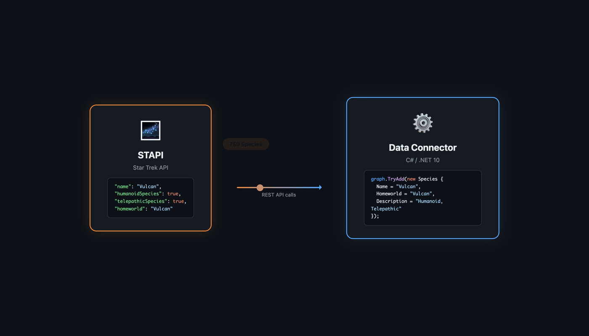
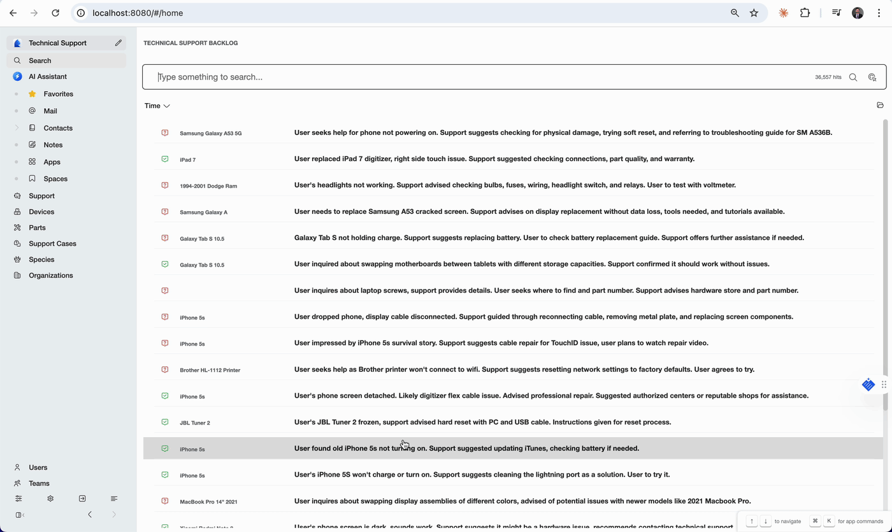
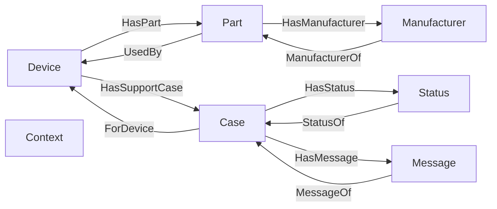

# Technical Support Sample Dataset

This repository contains a sample dataset designed for learning how to develop and deploy a [Curiosity Workspace](https://curiosity.ai/workspace) instance with custom data. The dataset includes fictional but realistic data on products, parts, and customer support cases generated using a large language model (LLM). This data can be used to experiment with Curiosity's knowledge graph, natural language processing and AI-powered features.

## Demo





## 🛠️ Pre-requisites

Before building or running this project, ensure the following tools are installed on your system:

1. **.NET SDK 10.0 or later**
   Required to build and run the project.
   ➤ Install from the official [.NET download page](https://dotnet.microsoft.com/en-us/download/dotnet/10.0)

2. **h5 Compiler**
   Used to transpile C# code to JavaScript via the h5 platform.
   ➤ Install via NuGet: [H5.Compiler on NuGet](https://www.nuget.org/packages/h5-compiler)
   You can install it globally using:

   ```bash
   dotnet tool install --global h5-compiler
   ```

3. **Curiosity CLI Tool**
   Required for working with a Curiosity Workspace from the command line.
   ➤ Install via NuGet: [Curiosity.CLI on NuGet](https://www.nuget.org/packages/Curiosity.CLI)
   You can install it globally using:

   ```bash
   dotnet tool install --global Curiosity.CLI
   ```

4. **Curiosity Workspace**
   Provides a full development environment for Curiosity-based projects.
   ➤ Follow the installation guide here: [Curiosity Workspace Installation](https://dev.curiosity.ai/getting-started/installation)


## 📊 Dataset Overview

The sample dataset consists of three primary datasets:

- **Devices**: A list of product names.
- **Parts**: A collection of parts associated with the products, including part names, manufacturer, and the products they belong to.
- **Support Cases**: Fictional AI-generated customer support cases related to the products and parts in the dataset, including a summary, conversation, applicable device, and resolution status.

The datasets have been generated to simulate realistic technical support data and offer a basis for testing and learning how to use the [Curiosity Library](https://www.nuget.org/packages/Curiosity.Library) to ingest and structure data on a Curiosity Workspace graph.

## [🗂️ Dataset Structure](/data/)

```
|-- /data/
|   |-- devices.json            # Product data
|   |-- parts.json              # Part data
|   |-- support-cases.json      # Support case data
|-- ...
```

## 🧬 Schema

The schema for the dataset is as follows:

```csharp
public class Device
{
    public string Name { get; set; }
}

public class Part
{
    public string Name { get; set; }
    public string Manufacturer { get; set; }
    public string[] Devices { get; set; }
}

public class SupportCase
{
    public string Summary { get; set; }
    public string Content { get; set; }
    public string Status { get; set; }
    public string Device { get; set; }
    public DateTimeOffset Time { get; set; }
}
```

One suggestion for a graph schema based on this data could be:



## 📚 Guides

1. [**Set up your Curiosity Workspace**](/workspace-setup/INSTRUCTIONS.md): Follow the [Curiosity Workspace documentation](https://dev.curiosity.ai) to get your environment ready.
2. [**Write a data connector**](/data-connector/INSTRUCTIONS.md): Write a sample [data connector](https://dev.curiosity.ai/data-sources/api-integrations) using the JSON files from the `data/` directory into your Curiosity Workspace. Explore the graph using the shell within the workspace.
3. [**Configure NLP parsing**](/nlp-configuration/INSTRUCTIONS.md): Setup natural processing pipelines and models to capture entities and link information on the graph.
4. [**Make the data searchable**](/search-configuration/INSTRUCTIONS.md): Use Curiosity’s administrative interfaces to configure [search and filtering](https://dev.curiosity.ai/search/introduction) for products, parts, and support cases.
5. [**Create your own API endpoints**](/custom-endpoints/INSTRUCTIONS.md): Practice implementing [custom API endpoints](https://dev.curiosity.ai/endpoints/introduction).
6. [**Build and deploy your own interface**](/custom-front-end/INSTRUCTIONS.md): Practice creating [custom user interfaces](https://dev.curiosity.ai/interfaces/introduction), implementing [custom API endpoints](https://dev.curiosity.ai/endpoints/introduction), and explore the graph using the shell within the workspace.

## 📝 License

This sample dataset is provided for educational and demonstration purposes only. It is not intended for any other use.

---

Happy exploring with Curiosity Workspace! 🚀

